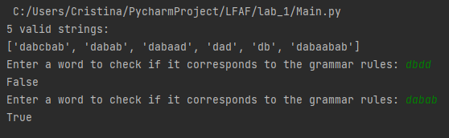
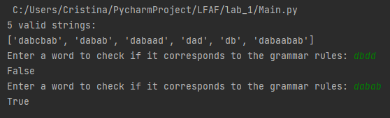

# Lab no. 1

### Course: Formal Languages & Finite Automata
### Author: Cristina Țărnă (I think it's mine)

----

## Objectives:

* Understand what a language is and what it needs to have in order to be considered a formal one.

* Provide the initial setup for the evolving project that I will work on during this semester. Basically I need to do the following:

* a. Create a local && remote repository of a VCS hosting service (let us all use Github to avoid unnecessary headaches);

 * b. Choose a programming language, and my suggestion would be to choose one that supports all the main paradigms;

* c. Create a separate folder where I will be keeping the report. This semester I wish I won't see reports alongside source code files, fingers crossed;

According to my variant number (by universal convention it is register ID), get the grammar definition and do the following tasks:

* a. Implement a type/class for your grammar;

* b. Add one function that would generate 5 valid strings from the language expressed by your given grammar;

* c. Implement some functionality that would convert and object of type Grammar to one of type Finite Automaton;

* d. For the Finite Automaton, please add a method that checks if an input string can be obtained via the state transition from it;


## Implementation description

### Code snippets from Grammar class:

```
class Grammar(FiniteAutomaton):
    def __init__(self, VN, VT, P, S):
        self.VN = VN
        self.VT = VT
        self.P = P
        self.S = S
        self.string = self.S

    def generateWord(self):
        list_string = list(self.string)
        final = not any(x in list_string for x in self.VN)

        if final is False:
            for letter in self.string:
                if letter in self.VN:
                    self.string = self.string.replace(letter, self.P[letter][r.randint(0, len(self.P[letter]) - 1)])
                    return self.generateWord()
        else:
            return self.string

    def toFiniteAutomaton(self):
        Q = set(self.VN + ['END'])
        Sigma = set(self.VT)
        delta = self.P_to_delta()
        q0 = 'S'
        F = {'END'}
        finite_automaton = FiniteAutomaton(Q=Q, Sigma=Sigma, delta=delta, q0=q0, F=F)
        return finite_automaton
```
Here, I create methods to generate a valid string, and to convert Grammar to Finite Automaton.

### Code snippets from Finite Automaton class:

```
    class FiniteAutomaton:
    def __init__(self, Q, Sigma, delta, q0, F):
        self.Q = Q
        self.Sigma = Sigma
        self.delta = delta
        self.q0 = q0
        self.F = F

    def stringBelongToLanguage(self, word: str):
        q = self.q0
        for c in word:
            if c not in self.Sigma:
                return False
            q = self.delta[q].get(c)
            if q is None:
                return False
        return q in self.F
```
Here the method checks if the string belongs to the language.


## Results


