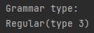
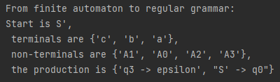
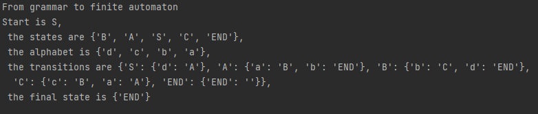
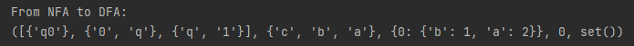
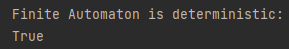

# Lab no. 2

### Course: Formal Languages & Finite Automata
### Author: Cristina Țărnă

----

## Objectives:
* Understand what an automaton is and what it can be used for.

* Continuing the work in the same repository and the same project, the following need to be added: 
  * a. Provide a function in your grammar type/class that could classify the grammar based on Chomsky hierarchy.
  * b. For this you can use the variant from the previous lab.

* According to your variant number (by universal convention it is register ID), get the finite automaton definition and do the following tasks:

  * a. Implement conversion of a finite automaton to a regular grammar.

  * b. Determine whether your FA is deterministic or non-deterministic.

  * c. Implement some functionality that would convert an NDFA to a DFA.

  * d. Represent the finite automaton graphically (Optional, and can be considered as a bonus point):

    * You can use external libraries, tools or APIs to generate the figures/diagrams.

    * Your program needs to gather and send the data about the automaton and the lib/tool/API return the visual representation.


## Implementation description

### Code snippets from Grammar class:

```
    def classify_grammar(self):
        unrestricted = True
        context_sensitive = True
        context_free = True
        regular = True
        regular_left = True
        regular_right = True

        for state, productions in self.P.items():
            for production in productions:
                # check if the grammar exist
                for char in production:
                    if char not in self.VT + self.VN:
                        unrestricted, context_sensitive, context_free, regular, regular_left, regular_right = False
                        return f"The {char} does not belong to this grammar."

                for char in state:
                    if char not in self.VT + self.VN:
                        unrestricted, context_sensitive, context_free, regular, regular_left, regular_right = False
                        return f"The {char} is not in grammar"

                # check if type 1 or 0
                if (len(production) > 2 or len(state) > 1) and any([state_v in self.VN for state_v in state]):
                    context_free, regular, regular_left, regular_right = False

                # check type 1
                if any([ch in self.VN for ch in state]):
                    print("", end='')
                else:
                    context_sensitive, context_free, regular, regular_left, regular_right = False

                # type 2 or 3
                if len(production) <= 2 and len(state) == 1 and context_free:
                    if any([char_r in self.VN or len(char_r) == 0 for char_r in [production[1:]]]):
                        print("", end='')
                    else:
                        regular_right = False

                    if any([char_l in self.VN or len(char_l) == 0 for char_l in [production[0:1]]]):
                        print("", end='')
                    else:
                        regular_left = False

        if regular_left or regular_right:
            print(f"Regular(type 3)")
        elif context_free:
            print(f"Context-free(type 2)")
        elif context_sensitive:
            print(f"Context-sensitive(type 1)")
        elif unrestricted:
            print(f"Unrestricted(type 0)")
```
Here, I created a function to classify the grammar type.

### Code snippets from Finite Automaton class:

```
       def to_regular_grammar(self):
        from lab_1.grammar.Grammar import Grammar

        V = set(self.Q)  # set of variables
        VN = {f"A{i}" for i in range(len(self.Q))}  # set of variables for the regular grammar
        VT = set(self.Sigma)  # set of terminals
        S = self.q0  # start variable
        S_prime = "S'"  # start variable for the regular grammar
        P = set()  # set of rules

        # create rules for transitions
        for state in self.Q:
            for symbol in self.Sigma:
                if (state, symbol) in self.delta:
                    next_state = self.delta[(state, symbol)]
                    rule = f"{state} -> {symbol}{next_state}"
                    P.add(rule)

        # create rules for accepting states
        for state in self.F:
            rule = f"{state} -> epsilon"
            P.add(rule)

        # create the start rule
        start_rule = f"{S_prime} -> {S}"
        P.add(start_rule)

        return Grammar(VN, VT, P, S_prime)
```
This function converts the finite automaton to regular grammar.
```
    def is_deterministic(self):
        # Create a set to keep track of the next states for each state and input symbol
        next_states = set()
        # Iterate over all transitions
        for state in self.Q:
            for symbol in self.Sigma:
                # Check if there is already a transition for the same state and input symbol
                if (state, symbol) in next_states:
                    return False
                else:
                    # Add the current transition to the set of next states
                    next_states.add((state, symbol))

        # If no duplicate transitions were found, the automaton is deterministic
        return True
```
This function returns True is the finite automaton is deterministic.
```
    def nfa_to_dfa(self):
        alphabet = set()
        for transitions in self.delta.values():
            alphabet.update(transitions.keys())

        start_state = self.q0
        dfa_states = [set([start_state])]
        dfa_transitions = {}
        unmarked_states = [0]

        while unmarked_states:
            index = unmarked_states.pop()
            current_state = dfa_states[index]

            for symbol in alphabet:
                next_state = set()
                for nfa_state in current_state:
                    if nfa_state in self.Q:
                        if symbol in self.delta[nfa_state]:
                            next_nfa_states = self.delta[nfa_state][symbol]
                        else:
                            next_nfa_states = set()
                    else:
                        next_nfa_states = set()
                    next_state.update(next_nfa_states)

                if next_state:
                    next_state = set(next_state)
                    if next_state not in dfa_states:
                        dfa_states.append(next_state)
                        unmarked_states.append(len(dfa_states) - 1)

                    current_symbol_transitions = dfa_transitions.get(index, {})
                    current_symbol_transitions[symbol] = dfa_states.index(next_state)
                    dfa_transitions[index] = current_symbol_transitions

        dfa_final_states = set()
        for i, state in enumerate(dfa_states):
            if state.intersection(self.F):
                dfa_final_states.add(i)

        return dfa_states, alphabet, dfa_transitions, 0, dfa_final_states
```
The function above converts a NFA to DFA.
## Results




