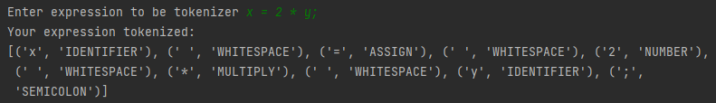

# Lab no. 3

### Course: Formal Languages & Finite Automata
### Author: Cristina Țărnă

----
## Short description:
The term lexer represents the process of extracting lexical tokens from a string of characters.
The lexeme is just the byproduct of splitting based on delimiters, for example spaces, but the tokens give names or categories to each lexeme.
## Objectives:
* Understand what lexical analysis is.

* Get familiar with the inner workings of a lexer/scanner/tokenizer.

* Implement a sample lexer and show how it works.

## Implementation description

### Code snippets from Lexer class:

```
  class Lexer:
  def __init__(self) -> object:
      self.input_string = None
      self.tokens_list = None
      self.tokens = {
          r'\bif\b': 'IF',
          r'\belse\b': 'ELSE',
          r'\bwhile\b': 'WHILE',
          r'\btrue\b': 'TRUE',
          r'\bfalse\b': 'FALSE',
          r'\bnot\b': 'NOT',
          r'\bor\b': 'OR',
          r'\band\b': 'AND',
          r'\(': 'LPAREN',
          r'\)': 'RPAREN',
          r'\{': 'LBRACE',
          r'\}': 'RBRACE',
          r';': 'SEMICOLON',
          r'\+': 'PLUS',
          r'-': 'MINUS',
          r'\*': 'MULTIPLY',
          r'/': 'DIVIDE',
          r'\*\*': 'POWER',
          r'=': 'ASSIGN',
          r'==': 'EQUALS',
          r'!=': 'NOTEQUALS',
          r'<': 'LESSTHAN',
          r'>': 'GREATERTHAN',
          r'<=': 'LESSTHANOREQUALS',
          r'>=': 'GREATERTHANOREQUALS',
          r'\d+(\.\d+)?': 'NUMBER',
          r'[a-zA-Z_]\w*': 'IDENTIFIER',
          r'\s+': 'WHITESPACE'
      }

  def tokenize(self, input_string):
      self.input_string = input_string
      self.tokens_list = []
      while self.input_string:
          match = None
          for pattern, token_type in self.tokens.items():
              regex = re.compile(pattern)
              match = regex.match(self.input_string)
              if match:
                  text = match.group(0)
                  self.tokens_list.append((text, token_type))
                  self.input_string = self.input_string[len(text):]
                  break
          if not match:
              raise ValueError(f'Invalid character: {self.input_string[0]}')
      return self.tokens_list
```
#### Let's dive deeper.
```
def __init__(self) -> object:
      self.input_string = None
      self.tokens_list = None
      self.tokens = {
          r'\bif\b': 'IF',
          r'\belse\b': 'ELSE',
          r'\bwhile\b': 'WHILE',
          r'\btrue\b': 'TRUE',
          r'\bfalse\b': 'FALSE',
          r'\bnot\b': 'NOT',
          r'\bor\b': 'OR',
          r'\band\b': 'AND',
          r'\(': 'LPAREN',
          r'\)': 'RPAREN',
          r'\{': 'LBRACE',
          r'\}': 'RBRACE',
          r';': 'SEMICOLON',
          r'\+': 'PLUS',
          r'-': 'MINUS',
          r'\*': 'MULTIPLY',
          r'/': 'DIVIDE',
          r'\*\*': 'POWER',
          r'=': 'ASSIGN',
          r'==': 'EQUALS',
          r'!=': 'NOTEQUALS',
          r'<': 'LESSTHAN',
          r'>': 'GREATERTHAN',
          r'<=': 'LESSTHANOREQUALS',
          r'>=': 'GREATERTHANOREQUALS',
          r'\d+(\.\d+)?': 'NUMBER',
          r'[a-zA-Z_]\w*': 'IDENTIFIER',
          r'\s+': 'WHITESPACE'
      }
```
Here I initialized the Lexer and defined the tokens for the lexer.
###
#### The tokenizing function
```
def tokenize(self, input_string):
  # Set the input string
  self.input_string = input_string
  # Initialize an empty list to hold the tokens
  self.tokens_list = []
  while self.input_string:
      # Initialize a variable to hold the current match
      match = None
      for pattern, token_type in self.tokens.items():
          regex = re.compile(pattern)
          match = regex.match(self.input_string)
          if match:
              text = match.group(0)
              self.tokens_list.append((text, token_type))
              self.input_string = self.input_string[len(text):]
              break
      if not match:
          raise ValueError(f'Invalid character: {self.input_string[0]}')
  return self.tokens_list
```
#### The function takes a string to be tokenized
```
def tokenize(self, input_string):
```
#### Loop until string is empty
```
  while self.input_string:
```

#### Loop through the token patterns
```
    for pattern, token_type in self.tokens.items():
     # Compile the pattern as a regular expression
            regex = re.compile(pattern)
            # Try to match the pattern to the input string
            match = regex.match(self.input_string)
            # If there's a match, create a token and add it to the list
            if match:
                text = match.group(0)
                self.tokens_list.append((text, token_type))
                self.input_string = self.input_string[len(text):]
                break
```
1. For each iteration of the loop, loop through the token patterns using a **for** 
loop that iterates over the **self.tokens** dictionary.
2. For each pattern, compile it into a regular expression using the **re.compile()** function.
3. Try to match the pattern to the input string using the **regex.match()** method. If there's a match, 
create a token and add it to the list of tokens.

```
            if not match:
                raise ValueError(f'Invalid character: {self.input_string[0]}')
```
If there's no match, raise a **ValueError** with a message indicating the first invalid character in the input string.

```
return self.tokens_list
```
Return the list of tokens.

### Code snippets from Main class:

```
expression = input("Enter expression to be tokenizer ")
print('Your expression tokenized:')
print(Lexer().tokenize(expression))      
```
Here, a string inputted by the user will be tokenized. 
A *Lexer* object is created using **Lexer()**, then the method **tokenize()** is applied 
on the *expression* inputted by the user. 
The **tokenize()** method breaks the input string down into a list of individual tokens using the regular expressions defined in the tokens dictionary, and returns the resulting list of tuples.
Finally, **print(Lexer().tokenize(expression))** prints the resulting list of tokens to the console.

## Results



