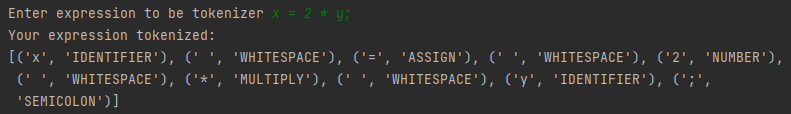

# Lab no. 4
## Topic: Chomsky Normal Form

### Course: Formal Languages & Finite Automata
### Author: Cristina Țărnă

----
## Objectives:
* Learn about Chomsky Normal Form (CNF).

* Get familiar with the approaches of normalizing a grammar.

* Implement a method for normalizing an input grammar by the rules of CNF.
    * The implementation needs to be encapsulated in a method with an appropriate signature (also ideally in an appropriate class/type).
    * The implemented functionality needs to be executed and tested.
    * A BONUS point will be given for the student who will have unit tests that validate the functionality of the project.
    * Also, another BONUS point would be given if the student will make the aforementioned function to accept any grammar, not only the one from the student's variant.

Variant 26

1. Eliminate epsilon productions.
2. Eliminate any renaming.
3. Eliminate inaccessible symbols.
4. Eliminate the non-productive symbols.
5. Obtain the Chomsky Normal Form.

G = (VN, VT,  P, S)
VN = {S, A, B, D } 
VT = {a, b, d} 

P = { S -> aBA ,
S -> AB ,
A -> d ,
A -> dS ,
A -> AbBA ,
A -> epsilon ,
B -> a ,
B -> aS ,
B -> A ,
D -> Aba 
}
## Implementation description

### Code snippets from Lexer class:
```
a
```
 
#### Let's dive deeper.
```
s
```


### Code snippets from Main class:

```
expression      
```

## Results
#####